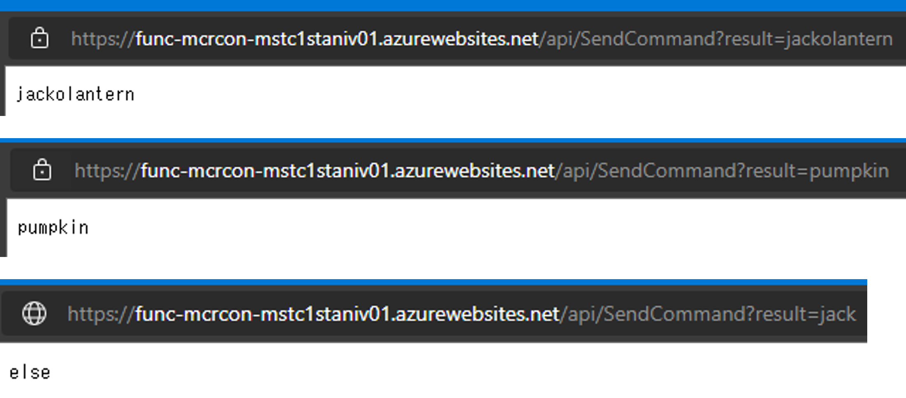
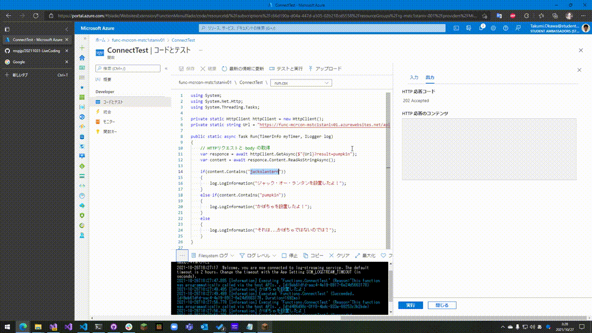

# 20211031-LiveCoding
## 概要
マインクラフトにコマンドを送信するための関数アプリと、それを呼び出すためのサンプルプログラムをまとめました。

|ファイル|概要|
|--|--|
|SendCommand.csx|マイクラにコマンドを送信するためのコード|
|function.proj|MinecraftConnection ライブラリを導入するためのファイル|
|ConnectTest.csx|SendCommandの関数アプリを実行して、その結果(body)を受け取るサンプルコード|

## 動作
関数アプリは https://func-mcrcon-mstc1staniv01.azurewebsites.net/api/SendCommand に設置しています。リクエストにて "result" 属性をつけてあげるとジャックオーランタン or かぼちゃをマイクラ上に設置することができます。

設置できているかどうかはマイクラサーバにログインしないとわかりませんが、関数アプリを実行するとページ上に文字列が表示されます。

|設置|レスポンス(body)|
|---|---|
|ジャックオーランタン|jackolantern|
|かぼちゃ|pumpkin|
|その他|else|

これらの値が表示されていれば正しく動作しています。（画像でも示しておきます。）



ジャックオーランタンを設置する

```
https://func-mcrcon-mstc1staniv01.azurewebsites.net/api/SendCommand?result=jackolantern
```

かぼちゃを設置する

```
https://func-mcrcon-mstc1staniv01.azurewebsites.net/api/SendCommand?result=pumpkin
```

## テストコードについて

ConnectTest.csx は関数アプリの実行結果 (body) を受け取るサンプルコードです。Slack用の関数アプリを呼び出す必要があるかと思いましたが HttpClient クラスを使用すると body要素を受け取れるみたいなので、この方法を使ってみました。

Slack 側の関数アプリのほうがコード量が圧倒的に多くて大変そうだと思いました...。

# 動かしている様子

